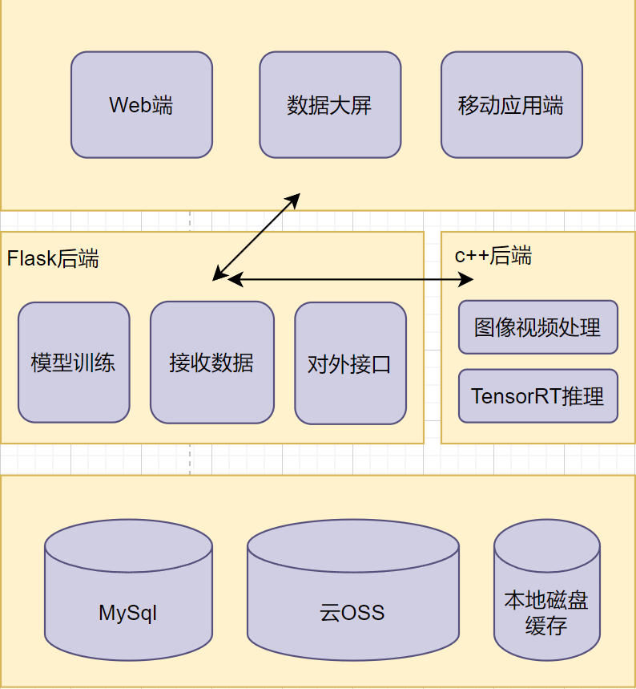
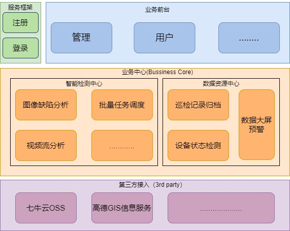
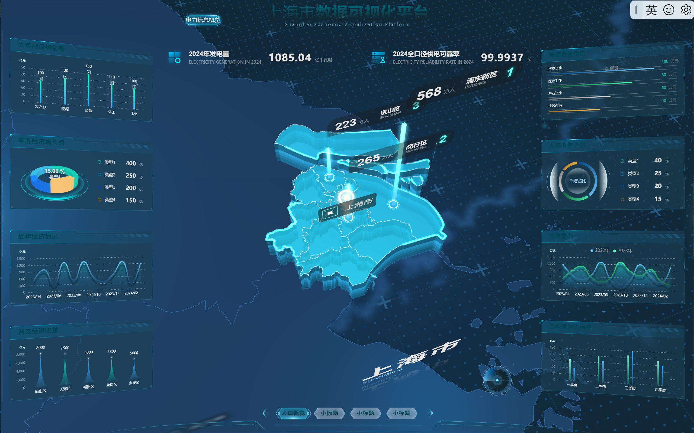
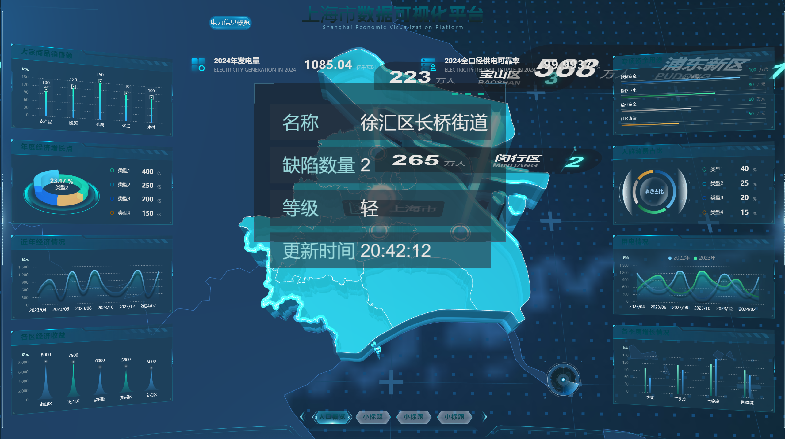
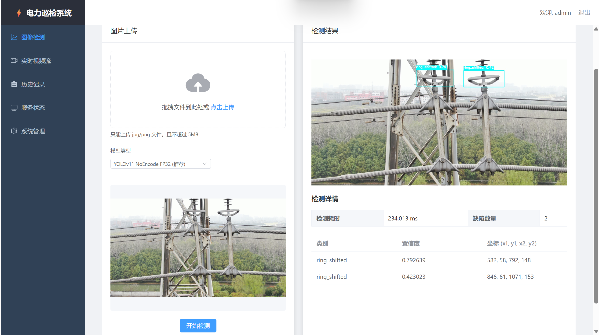
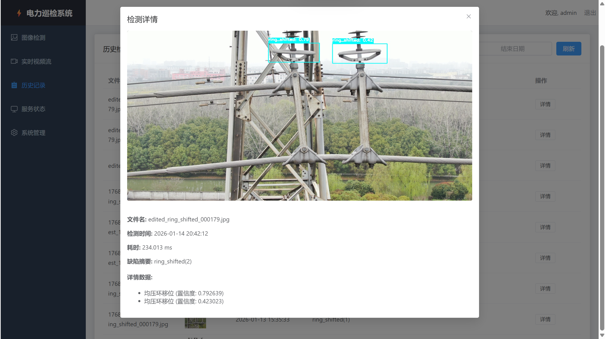
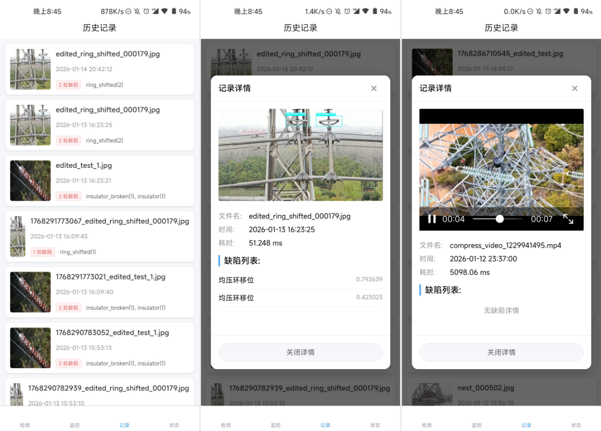
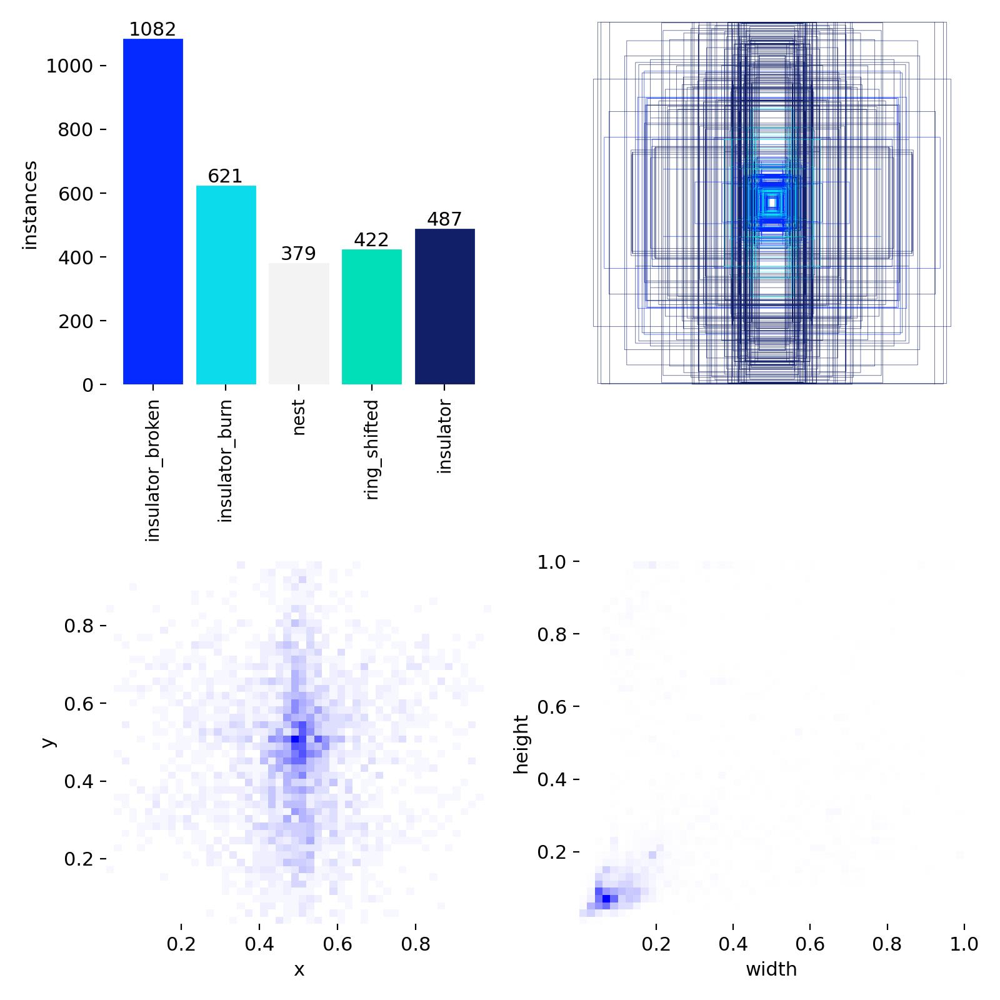
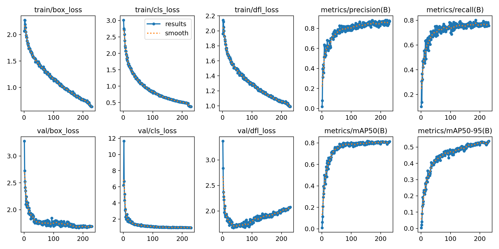

# ⚡ 电力设备缺陷智能检测系统 (YOLOv11-Electric)

[](https://www.python.org/)
[](https://isocpp.org/)
[](https://developer.nvidia.com/tensorrt)
[](https://vuejs.org/)

## 📖 项目简介

本项目是一款基于 **YOLOv11** 的高性能电力巡检系统，旨在通过计算机视觉技术自动识别电力设备（如绝缘子、鸟巢等）的缺陷。系统采用 **Windows (业务层) + WSL/Ubuntu (计算层)** 的高性能混合架构，利用 **TensorRT** 对模型进行极致推理加速，支持多端（Web、Mobile）展示。

### 核心亮点
- **极致性能**：C++ TensorRT 推理引擎，支持 FP16/INT8 量化，视频处理速度可达 100+ FPS。
- **混合架构**：Windows 宿主机负责复杂的业务逻辑与存储，WSL 环境专注高性能 GPU 推理。
- **多端覆盖**：提供基于 Vue3 的 Web 后台管理系统及基于 Uni-app 的移动端应用。
- **云端联动**：集成七牛云 OSS 存储，确保海量巡检图片的安全持久化。

---

## 🏗️ 系统架构

系统设计遵循高性能与低耦合原则，通过 **WSL 网络通信** 实现跨环境互调。


*图 1：系统逻辑架构与软硬件协同设计*


*图 2：电力巡检业务全链路流程图*

---

## 🖼️ 可视化展示

### 1. 数据大屏 (Data Dashboard)
提供实时的预警统计、缺陷分布图表以及地理位置分布信息。




### 2. 图像检测与历史记录
支持单图、批量图片及长视频检测，完整的检测链路追踪。


*Web 端检测交互界面*


*云端同步的检测历史记录*

### 3. 移动端应用 (Mobile App)
基于 Uni-app 开发，支持外场巡检人员实时拍摄并上传检测。



---

## 📈 算法训练与优化

基于 YOLOv11 架构，针对电力场景进行了深度调优。



*模型收敛与置信度表现*

---

## 📂 项目模块说明

```text
├── 01_Dataset             # 原始数据集与预处理脚本
├── 02_Training_PyTorch    # YOLOv11 训练代码与权重文件
├── 03_Conversion_Export   # ONNX 导出与 TensorRT 转换引擎
├── 04_Inference_TensorRT  # C++ 高性能推理源码 (运行于 WSL)
├── 05_API_Service         # 业务核心服务
│   ├── backend            # Flask 后端核心 (API 设计、OSS、数据库)
│   ├── frontend-vue       # Web 管理后台
│   └── frontend-uniapp    # 移动端巡检 App
└── docs/pics              # 项目相关图档资料
```

---

## 🚀 快速开始

1. **准备环境**：配置 Windows + WSL2 (Ubuntu)，安装 CUDA 11.8+ 及 TensorRT。
2. **启动推理引擎**：在 WSL 中进入 `04_Inference_TensorRT` 编译并运行 C++ 服务。
3. **部署后端**：在 Windows 下安装 `requirements.txt` 依赖，启动 Flask App。
4. **访问前端**：进入 `05_API_Service/frontend-vue` 运行 `npm run dev`。

---

## 📧 联系与反馈
如有疑问或建议，欢迎提交 Issue 或贡献代码。
